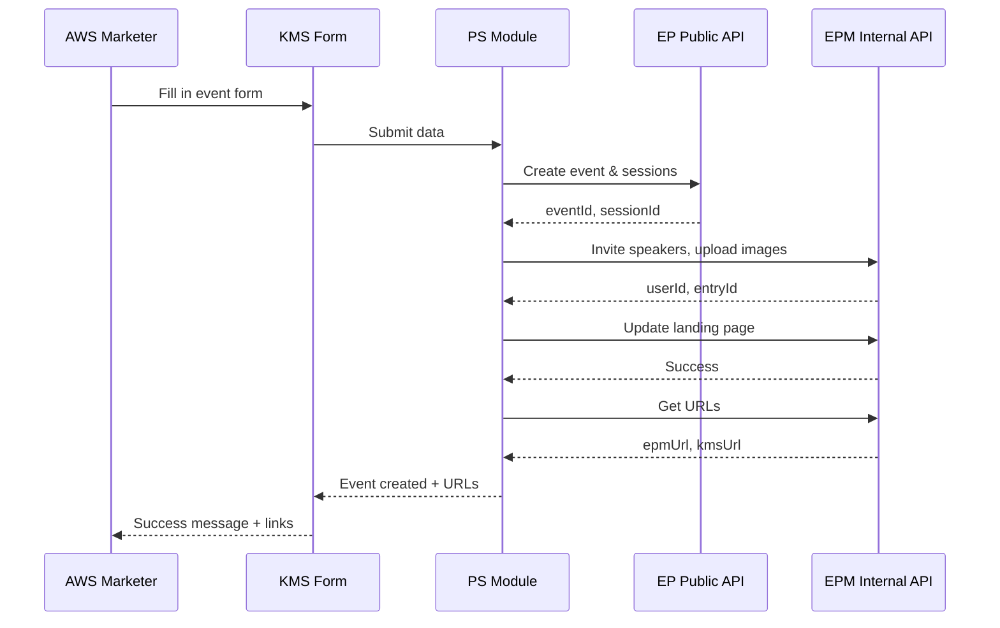

# AWS ABM Event-in-a-Box

**Streamlined event creation for Kaltura Event Platform**

---

## Business Context

AWS required a simplified workflow for creating Event Platform events for ABM campaigns. Marketers needed to create events with sessions, speakers, and landing pages without navigating complex EP interfaces.

---

## Solution Options Evaluated

Four approaches were evaluated:

1. **Training + EP Templates** - Train AWS team to use existing EP interface
2. **PS Custom Form** ⭐ **SELECTED** - Custom KMS form with PS backend
3. **EP Product Enhancement** - Enhance EP product for simplified workflow
4. **External App Infrastructure** - Build standalone application

**Decision**: Customer selected Option 2 (PS Custom Form) for immediate delivery.

**Full analysis**: [Solution Options Document](https://kaltura.atlassian.net/wiki/x/fYBQeAE)  
**Scoping**: [AWS ABM Scoping Definition](https://kaltura.atlassian.net/wiki/spaces/~173687690/pages/6330286086/AWS+ABM+-+Scoping+definition)

---

## Solution: PS Production Module

**Status**: Production development by PS team  
**Architecture**: KMS form → PS Module backend → EP/EPM APIs

### User Flow

1. AWS marketer navigates to KMS form (`/event-in-box`)
2. Fills in event details, speakers, sessions, landing page content
3. Submits form
4. PS backend orchestrates API calls to create event
5. Returns Event Platform URL and landing page preview

### Backend Architecture

The PS Module contains 18 PHP helper functions that orchestrate API calls:

**Event & Session Creation** (EP Public API):
- `createEvent()` - Creates event with template
- `createSession()` - Adds sessions to event agenda

**Speaker Management** (EPM Internal API):
- `inviteSpeakerToEvent()` - Invites speaker with details
- `addSpeakersToSession()` - Assigns speakers to specific sessions
- `uploadSpeakerImageComplete()` - Uploads speaker profile images

**Landing Page** (EPM Internal API):
- `getEventLandingPage()` - Retrieves landing page components
- `updateEventLandingPage()` - Updates landing page content
- `updateLandingPageTextContent()` - Updates specific text areas
- `uploadLandingPageImageComplete()` - Uploads landing page images

**Utilities**:
- `getEventUrls()` - Returns Event Platform management URL and public landing page URL
- Image and video upload functions

All functions include error handling, type safety, and audit logging.

### API Flow

**Documentation**: [PS Solution Confluence](https://kaltura.atlassian.net/wiki/x/swBReAE)

---

## Parallel Work: AI-Powered POC

**Status**: Temporary demonstration (not for production)  
**Built by**: Tom Cohen using Claude AI

Single HTML file showing rapid AI-powered development while PS team builds production solution.

**Features**: User login, event creation with speakers/sessions, direct API calls

**Limitations**: No SSO, no orchestration control, manual password entry, Kaltura users only

**Use Case**: Internal testing and AI demonstration

**Documentation**: [POC Confluence Page](https://kaltura.atlassian.net/wiki/x/pIAaegE)

---

## Repository Contents

**Backend** (`backend/helpers.php`):
- 18 PHP helper functions for PS module
- EP Public + EPM Internal API integration
- Event, session, speaker management
- Image/video uploads
- Landing page customization

**Frontend** (`frontend/`):
- Design prototypes and AI POC files

---

## Summary

**Production Solution**: PS Module with backend orchestration (customer delivery)  
**POC Solution**: AI-powered POC for internal demonstration (temporary)

**Customer Delivery**: Use PS production solution with full SSO and orchestration control.

---

## Team

**Kaltura Solutions Team**:
- Tom Cohen - Solution Engineer
- David Cohen - Backend Developer
- Rotem Haziz - Frontend Developer
- Shlomit Raivit - Design
- Gonen Radai - System Architect
- Tom Gabay - EP Director R&D

**AI Assistance**: Claude AI for rapid prototyping and backend development

**Project**: Internal Kaltura - AWS ABM use case

---

## License

MIT License
