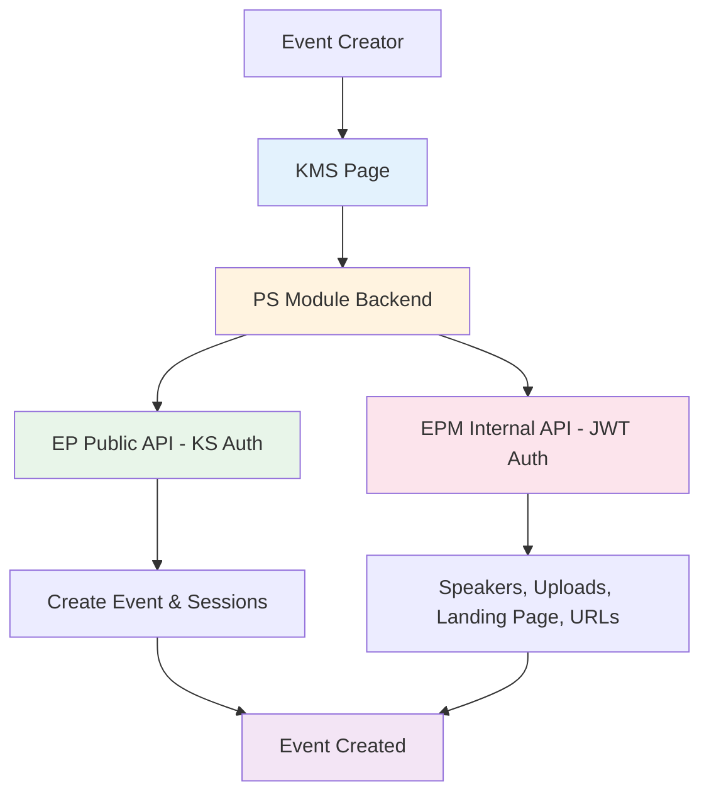
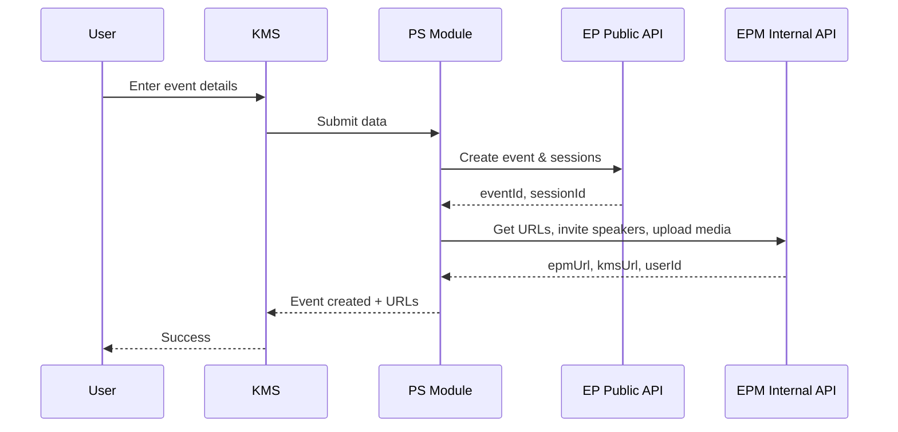
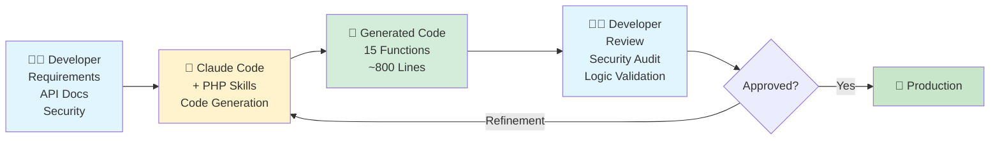

# AWS ABM Event-in-a-Box

**Automated event creation for Kaltura Event Platform**

Built with Claude Code + Developer Expertise + Solution Architecture


---

## Overview

AWS required a streamlined event creation workflow for ABM campaigns using Kaltura's Event Platform.

**Solution**: KMS page + PS module backend with 18 PHP helper functions orchestrating EP Public API and EPM Internal API.

**Repository contents**:
- `helpers.php` - Production PHP functions for PS module
- `embed-final-noauth.html` - POC prototype for design testing (reference)

**Development**: Human-AI collaboration using Claude Code to accelerate PS module development with professional standards and security practices.

---

## Solution Options Evaluated

Four approaches evaluated:

**Option 1**: Training + EP Templates (lowest cost, no risk)
**Option 2**: PS Custom Form ⭐ **SELECTED** (custom development, architectural concerns)
**Option 3A**: EP Product E2E (product investment, long-term)
**Option 3B**: EP Infrastructure for External App (infrastructure required)

**Decision**: Customer selected Option 2 despite architectural concerns.

---

## Architecture

### High-Level System Architecture



### API Request Flow



---

## Technical Stack

### Frontend
- **KMS Page**
- **EP design tokens** extracted via Playwright
- **POC**: HTML prototype in `frontend/` for testing

### Backend
- **PS Module** with 18 helper functions
- **PHP 7.4+**: Strict types, PSR-12, PHP 8.3+ features
- **Type Safety**: Comprehensive PHPDoc, input validation
- **Functions**: `backend/helpers.php` (used within PS module)

### APIs Integrated

**EP Public API** (KS Authentication):
- Base URL: `https://events-api.{region}.ovp.kaltura.com`
- Endpoints: `/api/v1/events/create`, `/api/v1/sessions/create`
- Authentication: Kaltura Session (KS) token

**EPM Internal API** (JWT Authentication):
- Base URL: `https://epm.{region}.ovp.kaltura.com`
- Endpoints: `/epm/*` (speakers, uploads, landing page)
- Authentication: JWT Bearer token + `x-eventId` header

**Kaltura Upload API** (KS Authentication):
- Base URL: `https://www.kaltura.com/api_v3`
- Endpoints: `/service/uploadtoken/action/upload`
- Purpose: Image and video file uploads

---

## Features

**PS Module capabilities**:

- Event creation with template selection
- Session (agenda) management with multiple types
- Speaker invitation and session assignment
- Image uploads (speakers, landing page)
- Video uploads (SimuLive sessions)
- Landing page customization (text, images)
- EPM management URL + KMS public URL generation

---

## Claude Code's Role in Development

### Development Methodology



### Three-Phase Development Process

#### Phase 1: Design Extraction & POC

**Human Input**:
- Event Platform screenshots
- Design requirements and specifications

**Claude Actions**:
- Used Playwright skill (`ep-design-extractor`) to extract design system
- Generated CSS with EP design tokens (colors, spacing, typography)
- Built HTML prototype for design testing and validation

**Output**:
- Design system CSS matching Event Platform
- POC HTML file (`embed-final-noauth.html`) for testing
- Form component styles

**Human Validation**:
- Visual review against EP screenshots
- Design testing with HTML prototype
- Refinements applied

#### Phase 2: PS Module Backend Development

**Human Input**:
- Complete API documentation (PUBLIC vs INTERNAL endpoints)
- Scoping requirements document
- PS module architecture guidance
- Security constraints

**Claude Actions**:
1. Installed PHP professional skills: `php-pro`, `php-best-practices`
2. Generated 18 helper functions for PS module backend
3. Distinguished API types:
   - **PUBLIC API**: KS authentication
   - **INTERNAL API**: JWT authentication + x-eventId header
4. Implemented strict type declarations, comprehensive PHPDoc, error handling

**Output**:
- Production-ready `helpers.php` (~800 lines) for PS module
- PSR-12 compliant, PHP 8.3+ features
- 18 functions (4 PUBLIC API, 11 INTERNAL API, 3 utilities)

**Human Validation**:
- Security review
- API logic verification
- PS module integration testing

#### Phase 3: Integration & Testing

**Human Input**:
- Authentication architecture (JWT and KS handling)
- Integration requirements
- Testing scenarios

**Claude Actions**:
- Built test scripts for function validation
- Created API integration patterns
- Generated usage documentation

**Output**:
- Complete working solution
- Test scripts
- Usage examples

**Human Validation**:
- End-to-end testing
- Security audit
- Production deployment verification

### Collaboration Pattern

```
Human Contribution:
├─ Strategic decisions
├─ API documentation and requirements
├─ Security architecture
├─ Validation and review
└─ Production deployment

Claude Contribution:
├─ Code generation
├─ Best practices enforcement
├─ Comprehensive documentation
├─ Type safety and error handling
└─ Testing patterns

Result: Production-Ready Solution
```

---

## Project Metrics
- **PHP Functions**: 18 (15 new + 3 utilities)
- **Lines of Code**: ~800
- **API Endpoints**: 15 total (4 PUBLIC, 11 INTERNAL)
- **Standards**: PSR-12, strict types, PHP 8.3+ features

---

## Quick Start

```php
// Create event and get URLs
$eventResult = createEvent($eventData, $ks);
$urlsResult = getEventUrls($eventResult['eventId']);
// Returns: epmUrl, kmsUrl

// Create session with speaker
$sessionResult = createSession($eventId, $sessionData, $ks);
$imageResult = uploadSpeakerImageComplete($eventId, $imageUrl);
$inviteResult = inviteSpeakerToEvent($eventId, $speaker, $imageResult['entryId']);
addSpeakersToSession($eventId, $sessionId, [['uid' => $inviteResult['userId'], 'order' => 1000]]);

// Update landing page
$pageResult = getEventLandingPage($eventId);
$components = updateLandingPageTextContent($components, $componentId, $newContent);
updateEventLandingPage($eventId, 'comingsoon', $components);
```

---

## API Functions

**18 PHP Helper Functions** in [backend/helpers.php](backend/helpers.php):
- **4 PUBLIC API**: Event/session creation, uploads (`createEvent`, `createSession`, `uploadImageFromURL`, `uploadVideoFromURL`)
- **11 INTERNAL API**: Speakers, landing page, credentials, URLs (`inviteSpeakerToEvent`, `addSpeakersToSession`, `getEventUrls`, etc.)
- **3 Convenience Wrappers**: Multi-step workflows combined

All functions include strict types, comprehensive PHPDoc, and error handling.

---

## Future Improvements & Next Steps

### 1. GitHub Access to Kaltura Organization Codebase

**Current Limitation**: Claude lacks access to Kaltura's private repositories

**Provide Access To**:

**PS Module Repository**:
- Learn PS module structure, patterns, and naming conventions
- Understand module registration, configuration, and lifecycle
- Follow Kaltura's PS coding standards automatically
- **Outcome**: Auto-generate PS-compliant modules (not standalone helpers)

**KMS Module Codebase**:
- Learn KMS integration patterns and hooks
- Understand module lifecycle and event handling
- Generate KMS-compatible modules
- **Outcome**: Proper KMS module structure, not workarounds

**Event Platform Backend Code**:
- Learn EP API patterns and validation logic
- Understand internal data structures and workflows
- Better error handling aligned with EP practices
- **Outcome**: Code that follows EP architectural patterns

**Kaltura Core Libraries**:
- Learn shared utilities and helper patterns
- Understand organizational code conventions
- Consistent error handling and logging patterns
- **Outcome**: Code that fits naturally into Kaltura ecosystem

**Benefits**:
- Claude generates code following Kaltura organizational standards
- Faster onboarding for new features and projects
- Consistent code quality across all Solutions team work
- Reduced code review cycles (follows standards from the start)
- Knowledge sharing embedded in AI (best practices always available)

### 2. Authentication Workflow Templates

Create vetted, secure patterns Claude can reuse:
- KS generation best practices
- JWT token handling
- Secure session management
- OAuth/SSO integration templates

### 3. Design & UI Integration

**Figma Access**:
- Figma API or plugin for real-time design extraction
- Sync with Kaltura design system updates
- Component library integration

**EP UI Components**:
- Access to EP frontend component library
- Learn component API and patterns
- Generate UI matching EP standards

### 4. Testing & Quality Automation

- PHPUnit test generation
- API integration test patterns
- PS module compatibility tests
- Automated code quality checks

---

## License

MIT License - See [LICENSE](LICENSE) file for details.

---

## Development Team

**Kaltura Team**:
- **Tom Cohen** - Solution Engineer, Architecture, Requirements
- **David Cohen** - Developer (Backend)
- **Rotem Haziz** - Developer (Frontend)
- **Shlomit Raivit** - Design
- **Gonen Radai** - System Architect
- **Tom Gabay** - EP Director R&D

**AI Collaboration**:
- **Claude Code (Sonnet 4.5)** - Code Generation, Best Practices, Documentation

**Internal Kaltura Project** - AWS ABM use case
