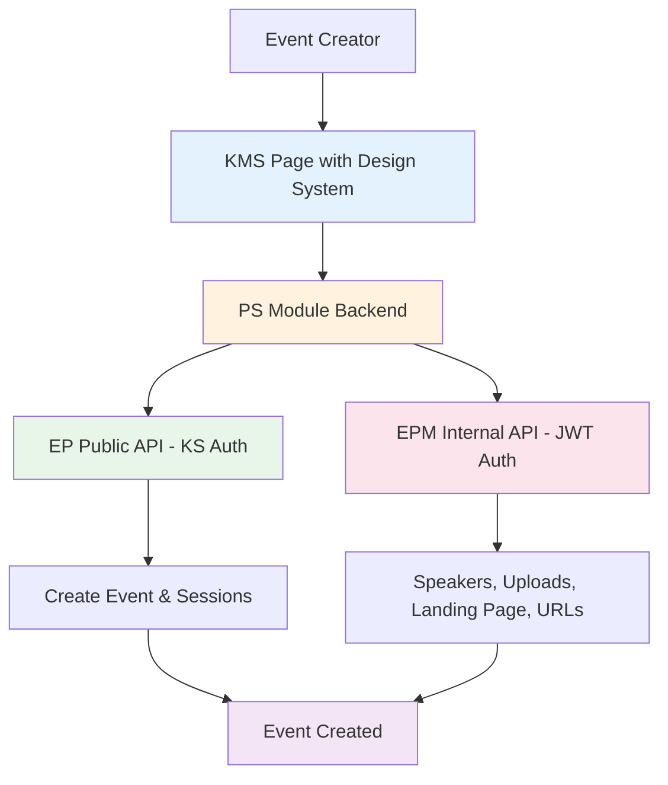
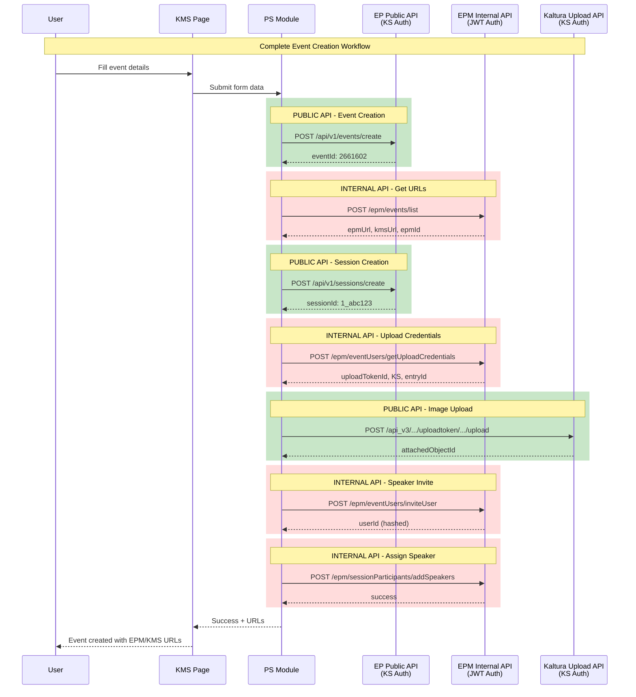
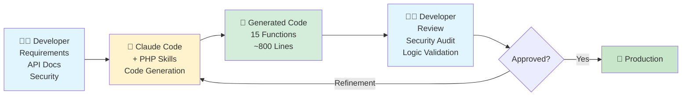

# AWS ABM Event-in-a-Box

**Automated event creation for Kaltura Event Platform**

Built with Claude Code + Developer Expertise + Solution Architecture


---

## Overview

### The Challenge

AWS required a streamlined event creation workflow for their ABM (Account-Based Marketing) campaigns using Kaltura's Event Platform. The goal was to simplify the event setup process while maintaining full Event Platform capabilities.

### The Solution

**Architecture**:
- **Frontend**: KMS page with Event Platform design system
- **Backend**: PS (Professional Services) module
- **Integration**: PHP helper functions orchestrating EP Public API and EPM Internal API

**What's in this repo**:
- `helpers.php` - Production PHP functions for PS module backend
- `embed-final-noauth.html` - POC/prototype used for design testing and validation (reference only)

### Development Approach

This project demonstrates **human-AI collaboration** using Claude Code to accelerate PS module development while maintaining professional standards, security practices, and architectural oversight.

---

## Solution Options Evaluated

Before proceeding with development, four solution approaches were evaluated with the customer:

### Option 1: Training + EP Templates + Avatar
- **Timeline**: 2-3 weeks
- **Cost**: Lowest (configuration only)
- **Risk**: None
- **Approach**: Use existing Event Platform capabilities with customized templates and training

### Option 2: PS Custom Form ⭐ **SELECTED**
- **Timeline**: 3-4 weeks
- **Cost**: Medium (custom development)
- **Risk**: Architectural concerns raised by engineering
- **Approach**: Build custom form in KMS with PHP backend
- **Customer Decision**: Customer chose this option acknowledging architectural trade-offs

### Option 3A: EP Product E2E Solution
- **Timeline**: Months (roadmap dependent)
- **Cost**: None (product investment)
- **Approach**: Wait for Event Platform product enhancements

### Option 3B: EP Infrastructure for External App
- **Timeline**: Unknown (infrastructure dependent)
- **Cost**: Medium (infrastructure + development)
- **Approach**: Event Platform APIs for external interfaces

**Final Decision**: Customer selected Option 2 (custom form) despite architectural concerns, prioritizing UX simplification over system consolidation.

---

## Architecture

### High-Level System Architecture



### API Request Flow



---

## Technical Stack

### Frontend
- **KMS Page** with Event Platform design system
- **Design System**: EP design tokens (colors, spacing, typography) extracted via Playwright
- **POC Reference**: HTML prototype in `frontend/` folder for design testing

### Backend
- **PS Module** (Professional Services module)
- **PHP 7.4+** with strict type declarations
- **Standards**: PSR-12, PHP 8.3+ features
- **Type Safety**: Strict types, comprehensive PHPDoc
- **Helper Functions**: 18 functions in `backend/helpers.php` (used within PS module)

### APIs Integrated

**EP Public API** (KS Authentication):
- Base URL: `https://events-api.{region}.ovp.kaltura.com`
- Endpoints: `/api/v1/events/create`, `/api/v1/sessions/create`
- Authentication: Kaltura Session (KS) token

**EPM Internal API** (JWT Authentication):
- Base URL: `https://epm.{region}.ovp.kaltura.com`
- Endpoints: `/epm/*` (speakers, uploads, landing page)
- Authentication: JWT Bearer token + `x-eventId` header

**Kaltura Upload API** (KS Authentication):
- Base URL: `https://www.kaltura.com/api_v3`
- Endpoints: `/service/uploadtoken/action/upload`
- Purpose: Image and video file uploads

---

## Features

**PS Module capabilities powered by helper functions**:

- ✅ Event creation with template selection
- ✅ Session (agenda) management with multiple types
- ✅ Speaker invitation and session assignment
- ✅ Image uploads (speakers, landing page)
- ✅ Video uploads (SimuLive sessions)
- ✅ Landing page customization (text, images)
- ✅ EPM management URL + KMS public URL generation

---

## Claude Code's Role in Development

### Development Methodology



### Three-Phase Development Process

#### Phase 1: Design System Extraction & POC
**Duration**: 2 days

**Human Input**:
- Event Platform screenshots
- Design requirements and specifications

**Claude Actions**:
- Used Playwright skill (`ep-design-extractor`) to extract design system
- Generated CSS with EP design tokens (colors, spacing, typography)
- Built HTML prototype for design testing and validation

**Output**:
- Design system CSS matching Event Platform
- POC HTML file (`embed-final-noauth.html`) for testing
- Form component styles

**Human Validation**:
- Visual review against EP screenshots
- Design testing with HTML prototype
- Refinements applied

#### Phase 2: PS Module Backend Development
**Duration**: 1 day

**Human Input**:
- Complete API documentation (PUBLIC vs INTERNAL endpoints)
- Scoping requirements document
- PS module architecture guidance
- Security constraints

**Claude Actions**:
1. Installed PHP professional skills: `php-pro`, `php-best-practices`
2. Generated 18 helper functions for PS module backend
3. Distinguished API types:
   - **PUBLIC API**: KS authentication
   - **INTERNAL API**: JWT authentication + x-eventId header
4. Implemented strict type declarations, comprehensive PHPDoc, error handling

**Output**:
- Production-ready `helpers.php` (~800 lines) for PS module
- PSR-12 compliant, PHP 8.3+ features
- 18 functions (4 PUBLIC API, 11 INTERNAL API, 3 utilities)

**Human Validation**:
- Security review
- API logic verification
- PS module integration testing

#### Phase 3: Integration & Testing
**Duration**: 1 day

**Human Input**:
- Authentication architecture (JWT and KS handling)
- Integration requirements
- Testing scenarios

**Claude Actions**:
- Built test scripts for function validation
- Created API integration patterns
- Generated usage documentation

**Output**:
- Complete working solution
- Test scripts
- Usage examples

**Human Validation**:
- End-to-end testing
- Security audit
- Production deployment verification

### Collaboration Pattern

```
Human Contribution:
├─ Strategic decisions
├─ API documentation and requirements
├─ Security architecture
├─ Validation and review
└─ Production deployment

Claude Contribution:
├─ Code generation
├─ Best practices enforcement
├─ Comprehensive documentation
├─ Type safety and error handling
└─ Testing patterns

Result: Production-Ready Solution
```

---

## Project Metrics

### Development Timeline
- **Total**: 4 days with Claude Code vs 10-12 days traditional
- **Time Savings**: 60-70%

### Code Statistics
- **PHP Functions**: 18 (15 new + 3 utilities)
- **Lines of Code**: ~800
- **API Endpoints**: 15 total (4 PUBLIC, 11 INTERNAL)
- **Standards**: PSR-12, strict types, PHP 8.3+ features

---

## Limitations & Future Improvements

While Claude Code significantly accelerated development, there were three key areas where human expertise and oversight remained essential:

### 1. PS Module Development 🔧

**Current Limitation**:
- Claude lacks access to Kaltura's PS (Professional Services) module codebase
- No understanding of Kaltura's PS coding standards and patterns
- Built standalone PHP helpers instead of PS-compliant modules

**Impact**:
- Solution works but isn't integrated into Kaltura's PS framework
- Requires custom deployment vs standard PS module installation

**Future Improvement**:
- Provide Claude with GitHub access to Kaltura's PS repository
- Enable Claude to learn PS standards, conventions, and patterns
- **Potential**: Auto-generate PS-compliant modules following Kaltura standards
- **Benefit**: Faster PS module development with quality guarantees

### 2. Authentication Implementation 🔐

**Current Limitation**:
- Sensitive security logic requires careful human oversight
- Authentication architecture designed with Claude, but implementation verified separately
- JWT and KS token generation handled outside Claude's direct implementation

**Impact**:
- Authentication code not included in this repository (sensitive)
- Claude provided architecture but not full security implementation

**Future Improvement**:
- Establish secure Claude workflows for authentication patterns
- Create vetted authentication templates Claude can use
- **Potential**: Claude generates auth code following security best practices
- **Benefit**: Faster secure authentication development with audit trail

### 3. Figma Design System Access 🎨

**Current Limitation**:
- No Figma API access or plugin integration
- Cannot directly extract design systems from Figma files
- Workaround: Screenshot-based extraction using Playwright

**Impact**:
- Manual design extraction process
- Potential for design drift if EP updates
- No live design system sync

**Future Improvement**:
- Figma plugin or API integration for Claude
- Direct access to design tokens and components
- **Potential**: Real-time design system extraction and updates
- **Benefit**: Always-accurate design system, no manual extraction

---

## Quick Start

```php
// Create event and get URLs
$eventResult = createEvent($eventData, $ks);
$urlsResult = getEventUrls($eventResult['eventId']);
// Returns: epmUrl, kmsUrl

// Create session with speaker
$sessionResult = createSession($eventId, $sessionData, $ks);
$imageResult = uploadSpeakerImageComplete($eventId, $imageUrl);
$inviteResult = inviteSpeakerToEvent($eventId, $speaker, $imageResult['entryId']);
addSpeakersToSession($eventId, $sessionId, [['uid' => $inviteResult['userId'], 'order' => 1000]]);

// Update landing page
$pageResult = getEventLandingPage($eventId);
$components = updateLandingPageTextContent($components, $componentId, $newContent);
updateEventLandingPage($eventId, 'comingsoon', $components);
```

---

## API Functions

**18 PHP Helper Functions** in [backend/helpers.php](backend/helpers.php):
- **4 PUBLIC API**: Event/session creation, uploads (`createEvent`, `createSession`, `uploadImageFromURL`, `uploadVideoFromURL`)
- **11 INTERNAL API**: Speakers, landing page, credentials, URLs (`inviteSpeakerToEvent`, `addSpeakersToSession`, `getEventUrls`, etc.)
- **3 Convenience Wrappers**: Multi-step workflows combined

All functions include strict types, comprehensive PHPDoc, and error handling.

---

## Future Improvements

**What Claude Could Do With More Access**:
1. **PS Module Generation** - With GitHub access to Kaltura PS codebase
2. **Secure Auth Workflows** - With vetted authentication templates
3. **Figma Integration** - With Figma API access for live design sync

---

## License

MIT License - See [LICENSE](LICENSE) file for details.

---

## Development Team

**Kaltura Team**:
- **Tom Cohen** - Solution Engineer, Architecture, Requirements
- **David Cohen** - Developer (Backend)
- **Rotem Haziz** - Developer (Frontend)
- **Shlomit Raivit** - Design
- **Gonen Radai** - System Architect
- **Tom Gabay** - EP Director R&D

**AI Collaboration**:
- **Claude Code (Sonnet 4.5)** - Code Generation, Best Practices, Documentation

**Internal Kaltura Project** - AWS ABM use case
