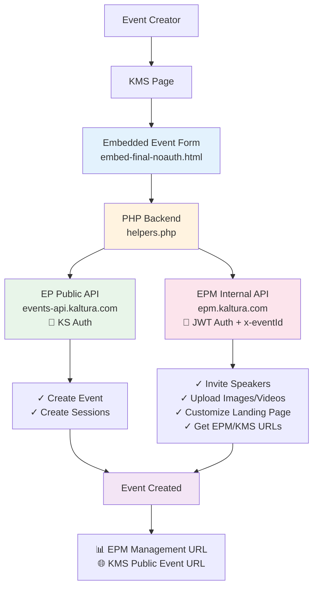
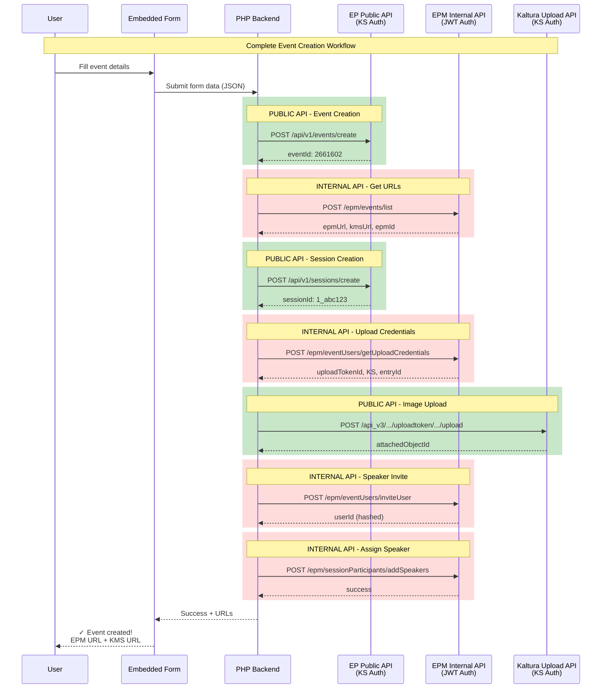
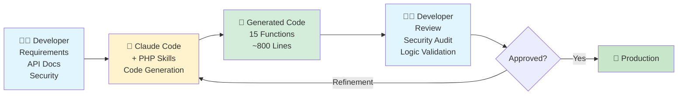

# AWS ABM Event-in-a-Box

**Automated event creation for Kaltura Event Platform**

Built with Claude Code + Developer Expertise + Solution Architecture


---

## Overview

### The Challenge

AWS required a streamlined event creation workflow for their ABM (Account-Based Marketing) campaigns using Kaltura's Event Platform. The goal was to simplify the event setup process while maintaining full Event Platform capabilities.

### The Solution

A custom embedded form integrated into KMS (Kaltura MediaSpace) with a PHP backend that orchestrates:
- **Event creation** with template selection
- **Session (agenda) management** with speaker assignments
- **Landing page customization** with images and content
- **Multi-step workflows** combining EP Public API and EPM Internal API

### Development Approach

This project demonstrates a **human-AI collaboration** using Claude Code to accelerate development while maintaining professional standards, security practices, and architectural oversight.

---

## Solution Options Evaluated

Before proceeding with development, four solution approaches were evaluated with the customer:

### Option 1: Training + EP Templates + Avatar
- **Timeline**: 2-3 weeks
- **Cost**: Lowest (configuration only)
- **Risk**: None
- **Approach**: Use existing Event Platform capabilities with customized templates and training

### Option 2: PS Custom Form ⭐ **SELECTED**
- **Timeline**: 3-4 weeks
- **Cost**: Medium (custom development)
- **Risk**: Architectural concerns raised by engineering
- **Approach**: Build custom form in KMS with PHP backend
- **Customer Decision**: Customer chose this option acknowledging architectural trade-offs

### Option 3A: EP Product E2E Solution
- **Timeline**: Months (roadmap dependent)
- **Cost**: None (product investment)
- **Approach**: Wait for Event Platform product enhancements

### Option 3B: EP Infrastructure for External App
- **Timeline**: Unknown (infrastructure dependent)
- **Cost**: Medium (infrastructure + development)
- **Approach**: Event Platform APIs for external interfaces

**Final Decision**: Customer selected Option 2 (custom form) despite architectural concerns, prioritizing UX simplification over system consolidation.

---

## Architecture

### High-Level System Architecture



### API Request Flow



---

## Technical Stack

### Frontend
- **HTML5** with embedded CSS and JavaScript
- **Design System**: Extracted from Event Platform using Playwright
- **CSS Framework**: Custom (EP design tokens - colors, spacing, typography)
- **Rich Text Editor**: Integrated for session descriptions
- **Validation**: Client-side + server-side
- **Deployment**: Embedded in KMS page

### Backend
- **PHP 7.4+** with strict type declarations
- **Composer** for dependency management
- **Architecture**: Helper functions + API proxy pattern
- **Standards**: PSR-12 coding standards, PHP 8.3+ features
- **Type Safety**: Strict types, PHPDoc return type arrays
- **Error Handling**: Try-catch with comprehensive logging
- **Security**: Environment variable configuration, input validation

### APIs Integrated

**EP Public API** (KS Authentication):
- Base URL: `https://events-api.{region}.ovp.kaltura.com`
- Endpoints: `/api/v1/events/create`, `/api/v1/sessions/create`
- Authentication: Kaltura Session (KS) token

**EPM Internal API** (JWT Authentication):
- Base URL: `https://epm.{region}.ovp.kaltura.com`
- Endpoints: `/epm/*` (speakers, uploads, landing page)
- Authentication: JWT Bearer token + `x-eventId` header

**Kaltura Upload API** (KS Authentication):
- Base URL: `https://www.kaltura.com/api_v3`
- Endpoints: `/service/uploadtoken/action/upload`
- Purpose: Image and video file uploads

---

## Features

### Event Management
- ✅ Event creation with template selection
- ✅ Configure event details (name, description, dates, timezone)
- ✅ Automatic EPM management URL generation
- ✅ Automatic KMS public event URL generation

### Session Management (Agenda)
- ✅ Create multiple sessions (agenda items)
- ✅ Support multiple session types (LiveWebcast, SimuLive, etc.)
- ✅ Rich text descriptions
- ✅ Session scheduling and duration

### Speaker Management
- ✅ Invite speakers to events
- ✅ Upload speaker profile images
- ✅ Assign speakers to sessions
- ✅ Multi-speaker support per session
- ✅ Speaker ordering and visibility control

### Media Management
- ✅ Image uploads from URLs (speaker profiles, landing page)
- ✅ Video uploads from URLs (SimuLive pre-recorded sessions)
- ✅ Thumbnail management
- ✅ 2-step upload workflow (credentials → upload)

### Landing Page Customization
- ✅ Retrieve current landing page configuration
- ✅ Update text content blocks
- ✅ Replace banner images
- ✅ Update "Two Images" side-by-side components
- ✅ Preserve existing page structure

---

## Claude Code's Role in Development

### Development Methodology



### Three-Phase Development Process

#### Phase 1: Design System Extraction
**Duration**: 2 days

**Human Input**:
- Event Platform screenshots
- Design requirements and specifications
- UI/UX expectations

**Claude Actions**:
- Used Playwright skill (`ep-design-extractor`) to extract design system
- Generated CSS with EP design tokens (colors, spacing, typography, shadows)
- Created component definitions matching EP interface

**Output**:
- Design system CSS matching Event Platform
- Color palette, typography, spacing tokens
- Form component styles

**Human Validation**:
- Visual review against EP screenshots
- Design accuracy verification
- Refinements and adjustments

#### Phase 2: PHP Backend Development
**Duration**: 1 day

**Human Input**:
- Complete API documentation (PUBLIC vs INTERNAL endpoints)
- Scoping requirements document
- Authentication architecture guidance
- Security constraints

**Claude Actions**:
1. Installed PHP professional skills:
   - `php-pro` - Modern PHP 8.3+ features, Laravel/Symfony patterns
   - `php-best-practices` - PSR standards, SOLID principles
2. Generated 15 type-safe helper functions
3. Distinguished API types:
   - **PUBLIC API**: KS authentication
   - **INTERNAL API**: JWT authentication + x-eventId header
4. Implemented PHP 8+ features:
   - Strict type declarations (`declare(strict_types=1)`)
   - Type hints for all parameters and return types
   - PHPDoc with structured return types
5. Added comprehensive error handling:
   - Try-catch blocks
   - Input validation (email, URL)
   - Temp file cleanup
   - Detailed logging

**Output**:
- Production-ready `helpers.php` (~800 lines)
- PSR-12 compliant code
- Comprehensive inline documentation
- 18 functions total (15 new + 3 utilities)

**Human Validation**:
- Security review (no hardcoded credentials)
- API logic verification
- Error handling validation
- Deployment testing

#### Phase 3: Integration & Testing
**Duration**: 1 day

**Human Input**:
- Authentication architecture (JWT and KS handling)
- Integration requirements
- Testing scenarios

**Claude Actions**:
- Built test scripts for function validation
- Created API integration patterns
- Generated usage documentation

**Output**:
- Complete working solution
- Test scripts
- Usage examples

**Human Validation**:
- End-to-end testing
- Security audit
- Production deployment verification

### Collaboration Pattern

```
Human Contribution:
├─ Strategic decisions
├─ API documentation and requirements
├─ Security architecture
├─ Validation and review
└─ Production deployment

Claude Contribution:
├─ Code generation
├─ Best practices enforcement
├─ Comprehensive documentation
├─ Type safety and error handling
└─ Testing patterns

Result: Production-Ready Solution
```

---

## Project Metrics

### Development Timeline
- **Design Extraction**: 2 days
- **Backend Development**: 1 day
- **Integration & Testing**: 1 day
- **Total**: ~4 days with Claude Code vs **~10-12 days** traditional development
- **Time Savings**: **60-70%**

### Code Statistics
- **PHP Functions**: 18 total (15 new + 3 utilities)
- **Lines of Code**: ~800 (helpers.php)
- **API Endpoints Integrated**:
  - 4 EP Public API endpoints
  - 8 EPM Internal API endpoints
  - 3 Kaltura Upload API endpoints
- **Convenience Wrappers**: 3 (multi-step workflows combined)
- **Code Quality**:
  - ✅ PSR-12 compliant
  - ✅ Strict type declarations
  - ✅ Comprehensive PHPDoc
  - ✅ Input validation
  - ✅ Error handling
  - ✅ Security best practices

### Quality Improvements with Claude
- **Type Safety**: All functions use strict types and type hints
- **Documentation**: Every function has comprehensive PHPDoc
- **Error Handling**: Proper try-catch with cleanup
- **Validation**: Email, URL, array structure validation
- **Security**: No hardcoded credentials, proper temp file cleanup
- **Standards**: PSR-12, modern PHP 8.3+ features

---

## Limitations & Future Improvements

While Claude Code significantly accelerated development, there were three key areas where human expertise and oversight remained essential:

### 1. PS Module Development 🔧

**Current Limitation**:
- Claude lacks access to Kaltura's PS (Professional Services) module codebase
- No understanding of Kaltura's PS coding standards and patterns
- Built standalone PHP helpers instead of PS-compliant modules

**Impact**:
- Solution works but isn't integrated into Kaltura's PS framework
- Requires custom deployment vs standard PS module installation

**Future Improvement**:
- Provide Claude with GitHub access to Kaltura's PS repository
- Enable Claude to learn PS standards, conventions, and patterns
- **Potential**: Auto-generate PS-compliant modules following Kaltura standards
- **Benefit**: Faster PS module development with quality guarantees

### 2. Authentication Implementation 🔐

**Current Limitation**:
- Sensitive security logic requires careful human oversight
- Authentication architecture designed with Claude, but implementation verified separately
- JWT and KS token generation handled outside Claude's direct implementation

**Impact**:
- Authentication code not included in this repository (sensitive)
- Claude provided architecture but not full security implementation

**Future Improvement**:
- Establish secure Claude workflows for authentication patterns
- Create vetted authentication templates Claude can use
- **Potential**: Claude generates auth code following security best practices
- **Benefit**: Faster secure authentication development with audit trail

### 3. Figma Design System Access 🎨

**Current Limitation**:
- No Figma API access or plugin integration
- Cannot directly extract design systems from Figma files
- Workaround: Screenshot-based extraction using Playwright

**Impact**:
- Manual design extraction process
- Potential for design drift if EP updates
- No live design system sync

**Future Improvement**:
- Figma plugin or API integration for Claude
- Direct access to design tokens and components
- **Potential**: Real-time design system extraction and updates
- **Benefit**: Always-accurate design system, no manual extraction

---

## Installation & Setup

### Prerequisites
- PHP 7.4 or higher
- Composer
- Kaltura MediaSpace (KMS) environment
- Access to Kaltura Event Platform

### Backend Setup

1. **Install Dependencies**
```bash
cd backend/
composer install
```

2. **Configure Environment**
```bash
# Copy example config
cp config.example.php config.php

# Edit config.php and set:
# - EPM_JWT_TOKEN (from your EPM account)
# - EP_API_BASE_URL (your region)
# - EPM_API_BASE_URL (your region)
```

3. **Set Permissions**
```bash
chmod 755 *.php
mkdir logs && chmod 777 logs
```

### Frontend Deployment

1. **Upload to KMS**
   - Copy `frontend/embed-final-noauth.html` content
   - Create new KMS page
   - Paste HTML into page HTML editor
   - Publish page

2. **Configure Backend Endpoint**
   - Update form API endpoint in HTML
   - Point to your PHP backend URL

---

## Usage Examples

### Example 1: Create Event and Get URLs

```php
<?php
require_once 'backend/helpers.php';

// Step 1: Create event (PUBLIC API)
$eventData = [
    'name' => 'AWS Virtual Summit 2026',
    'description' => 'Exclusive tech briefing for key accounts',
    'startDate' => '2026-06-15T14:00:00Z',
    'endDate' => '2026-06-15T17:00:00Z',
    'timezone' => 'America/New_York',
    'templateId' => 'tm4000'
];

$eventResult = createEvent($eventData, $ks);

if ($eventResult['success']) {
    $eventId = $eventResult['eventId'];

    // Step 2: Get EPM and KMS URLs (INTERNAL API)
    $urlsResult = getEventUrls($eventId);

    if ($urlsResult['success']) {
        echo "Event Created Successfully!\n\n";
        echo "Manage Event: {$urlsResult['epmUrl']}\n";
        echo "Public Event: {$urlsResult['kmsUrl']}\n";
    }
}
```

### Example 2: Create Session with Speaker

```php
// Step 1: Create session
$sessionData = [
    'name' => 'Opening Keynote',
    'type' => 'LiveWebcast',
    'startDate' => '2026-06-15T14:00:00Z',
    'endDate' => '2026-06-15T15:00:00Z',
    'description' => '<p>Welcome address by CEO</p>'
];

$sessionResult = createSession($eventId, $sessionData, $ks);
$sessionId = $sessionResult['sessionId'];

// Step 2: Upload speaker image and invite
$imageUrl = 'https://example.com/ceo-photo.jpg';
$imageResult = uploadSpeakerImageComplete($eventId, $imageUrl);

$speaker = [
    'firstName' => 'Jane',
    'lastName' => 'Smith',
    'email' => 'jane.smith@company.com',
    'title' => 'CEO',
    'company' => 'Acme Corporation',
    'bio' => '<p>Technology leader with 20+ years experience</p>'
];

$inviteResult = inviteSpeakerToEvent(
    $eventId,
    $speaker,
    $imageResult['entryId'],
    true
);

// Step 3: Assign speaker to session
$speakers = [
    ['uid' => $inviteResult['userId'], 'order' => 1000, 'isHidden' => false]
];

addSpeakersToSession($eventId, $sessionId, $speakers);
```

### Example 3: Update Landing Page with Custom Images

```php
// Step 1: Get current landing page
$pageResult = getEventLandingPage($eventId);
$components = $pageResult['components'];

// Step 2: Update text content
$components = updateLandingPageTextContent(
    $components,
    '1039159465',  // Text component ID
    '<div><strong>About the Event</strong></div><div>Join us for an exclusive AWS virtual summit.</div>'
);

// Step 3: Upload and replace banner image
$bannerImageUrl = 'https://example.com/event-banner.jpg';
$bannerResult = uploadLandingPageImageComplete($eventId, $bannerImageUrl);
$components = replaceBannerImage($components, '100010771', $bannerResult['entryId']);

// Step 4: Upload and replace two side-by-side images
$leftImageUrl = 'https://example.com/feature-1.jpg';
$rightImageUrl = 'https://example.com/feature-2.jpg';

$leftResult = uploadLandingPageImageComplete($eventId, $leftImageUrl);
$rightResult = uploadLandingPageImageComplete($eventId, $rightImageUrl);

$components = replaceTwoImagesComponent(
    $components,
    '100038427',  // TwoImages component ID
    $leftResult['entryId'],
    $rightResult['entryId']
);

// Step 5: Save landing page updates
updateEventLandingPage($eventId, 'comingsoon', $components);
```

---

## API Reference

### Function Summary by API Type

#### 🌐 EP Public API Functions (KS Auth)
| Function | Endpoint | Purpose |
|----------|----------|---------|
| `createEvent()` | `/api/v1/events/create` | Create new event |
| `createSession()` | `/api/v1/sessions/create` | Create session (agenda item) |

#### 🔐 EPM Internal API Functions (JWT Auth + x-eventId)
| Function | Endpoint | Purpose |
|----------|----------|---------|
| `getEventUrls()` | `/epm/events/list` | Get EPM & KMS URLs |
| `inviteSpeakerToEvent()` | `/epm/eventUsers/inviteUser` | Invite speaker |
| `addSpeakersToSession()` | `/epm/sessionParticipants/addSpeakers` | Assign speakers |
| `getSpeakerImageUploadCredentials()` | `/epm/eventUsers/getUploadCredentials` | Get speaker image creds |
| `getLandingPageImageUploadCredentials()` | `/epm/settings/getUploadCredentials` | Get LP image creds |
| `getVideoUploadCredentials()` | `/epm/media/getBulkMediaCredentials` | Get video creds |
| `getEventLandingPage()` | `/epm/pageBuilder/getEventPage` | Get landing page config |
| `updateEventLandingPage()` | `/epm/pageBuilder/updateEventPage` | Update landing page |

#### 🎨 Landing Page Helper Functions
| Function | Purpose |
|----------|---------|
| `updateLandingPageTextContent()` | Update text blocks |
| `replaceBannerImage()` | Replace banner with `replaceImageEntry` |
| `replaceTwoImagesComponent()` | Replace side-by-side images |
| `findLandingPageComponent()` | Find component by type and ID |

#### ⚡ Convenience Wrappers (Multi-Step Combined)
| Function | Combines |
|----------|----------|
| `uploadSpeakerImageComplete()` | Get creds (INTERNAL) + Upload (PUBLIC) |
| `uploadLandingPageImageComplete()` | Get creds (INTERNAL) + Upload (PUBLIC) |
| `uploadVideoComplete()` | Get creds (INTERNAL) + Upload (PUBLIC) |

---

## Project Structure

```
abm-in-a-box/
├── README.md                          # This file
├── LICENSE                            # MIT License
├── .gitignore                         # Git exclusions
├── frontend/
│   └── embed-final-noauth.html       # Production embed form (75 KB)
├── backend/
│   ├── helpers.php                   # 18 PHP helper functions (~800 lines)
│   ├── config.example.php            # Configuration template
│   └── composer.json                 # PHP dependencies
└── docs/
    └── (future: API detailed docs)
```

---

## Contributing & Roadmap

### Future Enhancements

**Short-Term**:
- Additional EP features (registrations, analytics)
- Enhanced error reporting and debugging
- More landing page component helpers

**Medium-Term**:
- PS module generation with Claude + Kaltura codebase access
- Authentication workflow templates
- Automated testing suite

**Long-Term**:
- Figma plugin for live design system sync
- AI-powered event optimization recommendations
- Integration with other Kaltura products

### How to Contribute

This project demonstrates human-AI collaboration patterns. Future contributors can:

1. **Extend functionality**: Add more EP API integrations
2. **Improve documentation**: Enhance code examples and guides
3. **Share learnings**: Document Claude Code collaboration patterns
4. **Suggest improvements**: Identify areas where Claude could be more effective

---

## License

MIT License - See [LICENSE](LICENSE) file for details.

---

## Acknowledgments

**Development Team**:
- Tom Cohen - Solution Engineer, Architecture, Requirements
- Claude Code (Opus 4.6) - Code Generation, Best Practices, Documentation

**Skills Used**:
- `php-pro` - Modern PHP development patterns
- `php-best-practices` - PSR standards and SOLID principles
- `ep-design-extractor` - Event Platform design system extraction
- `diagram-generator` - Technical diagrams and flows

**Built with**: [Claude Code](https://claude.ai/code) by Anthropic

---

## Support & Contact

For questions or issues related to this project:
- **Internal**: Contact Kaltura Solutions Team
- **Issues**: Use GitHub Issues for bug reports and feature requests

**Note**: This is an internal Kaltura project for AWS ABM use case. Not for external distribution.
